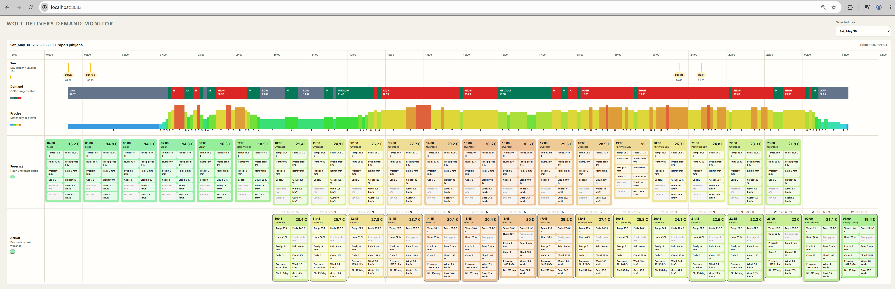

# Overview

This is mostly a personal project, but it might also come in handy for somebody else. The goal is to get some clues when it makes sense to get out and do deliveries - and actually be getting tasks. I'm not a professional delivery guy. I do this sometimes, mostly as a paid workout.

This project collects data from Wolt's courier app (taking periodic screenshots using adb) and then uses OCR and OpenCV's matchTemplate to extract information about current demand. It also collects weather data and displays it as a web page for the selected day. I'm mostly interested in the day's peak and which day of the week makes the most sense (which must also work with my schedule).

Possible improvements:
- collect "Earn extra" - boosts and display along (announcement time, period of "Earn extra", and an extra % probably has some influence) of the demand for and around that period.

Other notes:
- UI and UI test are mostly vibe coded, so code quality is slightly lower than what's needed to receive the Nobel price.

UI screenshot for a busy hot Saturday:



# Tools needed on host system (tested on ubuntu 26.04)
```bash
sudo apt install -y tesseract-ocr imagemagick adb
# ubuntu 26.04
sudo apt install android-udev-rules
# ubuntu 24.04
sudo udevadm control --reload-rules
sudo udevadm trigger
# test connection
adb kill-server
adb start-server
adb devices # confirm on the phone
```

# Pollers
```bash
# periodic collecting of text and visual clues of current delivery demand
./script.sh
# needed to run once a day, to get sunrise, sunset and hourly weather forecast for current day
./weather.sh daily
# periodic collection of current weather (15 min increments)
./weather.sh mon
```

# now-matcher
Matches exact position of the selected template (cropped section of the image). The output is y axis position of the match (if confidence is big enough).
```bash
# build
docker compose -f now-matcher/docker-compose.yml build
# match default image - demand.png
docker compose -f now-matcher/docker-compose.yml --progress=quiet run --rm matcher
# match selected image - in this case sslog/demand_2026-05-30_00-23-22.png
docker compose -f now-matcher/docker-compose.yml --progress=quiet run --rm -e SCREENSHOT=sslog/demand_2026-05-30_00-23-22.png matcher
```

# UI
Visually displays selected date (demand along with weather info)
```bash
docker compose -f ui/docker-compose.yml up -t=0 -d --build
```

# UI test
Uses puppeteer to get UI's rendering (mostly for AI to get visual feedback)
```bash
docker compose -f ui_test/docker-compose.yml run --build --rm puppeteer
# update deps
docker compose -f ui_test/docker-compose.yml run --build --rm update-deps
```


# Calibrating values for my device

## level 0 (low - zero)
```bash
$ docker compose -f now-matcher/docker-compose.yml --progress=quiet run --rm -e SCREENSHOT=sslog/demand_2026-05-30_00-55-51.png matcher
y_top=830
confidence=0.993
```

## level 1 (low - lowest)
```bash
$ docker compose -f now-matcher/docker-compose.yml --progress=quiet run --rm -e SCREENSHOT=sslog/demand_2026-05-30_00-48-45.png matcher
y_top=805
confidence=0.982
```

## level 2 (low - medium)
```bash
$ docker compose -f now-matcher/docker-compose.yml --progress=quiet run --rm -e SCREENSHOT=sslog/demand_2026-05-30_00-38-36.png matcher
y_top=779
confidence=0.982
```

## level 3 (low - highest)
```bash
$ docker compose -f now-matcher/docker-compose.yml --progress=quiet run --rm -e SCREENSHOT=sslog/demand_2026-05-30_00-23-22.png matcher
y_top=754
confidence=0.992
```

## level 4 (medium - lowest)
```bash
$ docker compose -f now-matcher/docker-compose.yml --progress=quiet run --rm -e SCREENSHOT=sslog/demand_2026-05-30_00-08-09.png matcher
y_top=729
confidence=0.966
```

## level 5 (medium - medium)
```bash
$ docker compose -f now-matcher/docker-compose.yml --progress=quiet run --rm -e SCREENSHOT=sslog/demand_2026-05-29_23-48-52.png matcher
y_top=704
confidence=0.993
```

## level 6 (medium - highest)
```bash
$ docker compose -f now-matcher/docker-compose.yml --progress=quiet run --rm -e SCREENSHOT=sslog/demand_2026-05-29_23-28-34.png matcher
y_top=679
confidence=0.982
```

## level 7 (high - lowest) - phone 2
```bash
docker compose -f now-matcher/docker-compose.yml --progress=quiet run --rm -e SCREENSHOT=sslog/demand_2026-05-30_21-39-51.png matcher
y_top=650
confidence=0.982
```

## level 8 (high - medium) - phone 2
```bash
docker compose -f now-matcher/docker-compose.yml --progress=quiet run --rm -e SCREENSHOT=sslog/demand_2026-05-30_21-45-00.png matcher
y_top=625
confidence=0.992
```

## level 9 (high - highest) - phone 2
```bash
docker compose -f now-matcher/docker-compose.yml --progress=quiet run --rm -e SCREENSHOT=sslog/demand_2026-05-30_21-29-34.png matcher
y_top=600
confidence=0.966
```

## Summary (phone2 has values shifted by 3)
```
603 or 600 - level 9
628 or 625 - level 8
653 or 650 - level 7
679 or 676 - level 6
704 or 701 - level 5
729 or 726 - level 4
754 or 751 - level 3
779 or 776 - level 2
805 or 802 - level 1
830 or 827 - level 0
```

